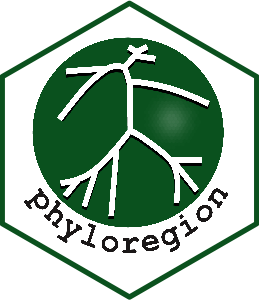
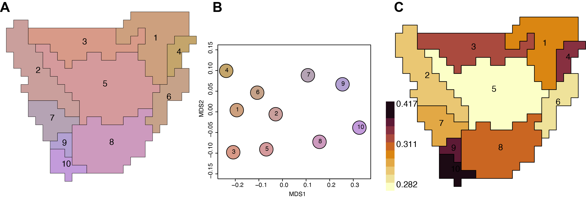

[](https://github.com/darunabas/phyloregion/actions)
[](https://cran.r-project.org/package=phyloregion)
[](https://cran.r-project.org/package=phyloregion)
[](https://app.codecov.io/gh/darunabas/phyloregion)

# phyloregion 

An R package for biogeographic regionalization (the classification of geographical areas in terms of their biotas) and macroecology. With macroecological datasets of ever increasing size and complexity, `phyloregion` offers the possibility of handling and executing very large scale analysis of biogeographic regionalization. It also allows fast and memory efficient analysis of standard conservation measures such as phylogenetic diversity, phylogenetic endemism, evolutionary distinctiveness and global endangerment. `phyloregion` can run on any operating system (Mac, Linux, Windows or even high performance computing cluster) with `R` 3.6.0 (or higher) installed.




### How to cite
The original implementation of ```phyloregion``` is described in:

Daru, B.H., Karunarathne, P. & Schliep, K. (2020) phyloregion: R package for biogeographic regionalization and macroecology. **_Methods in Ecology and Evolution_** __11__: 1483-1491. [doi: 10.1111/2041-210X.13478](https://doi.org/10.1111/2041-210X.13478).

It is based on the method described in:

Daru, B.H., Farooq, H., Antonelli, A. & Faurby, S. (2020) Endemism patterns are scale dependent. **_Nature Communications_** __11__: 2115 [doi: 10.1038/s41467-020-15921-6](https://doi.org/10.1038/s41467-020-15921-6). 

The original conceptual is described in:

Daru, B.H., Elliott, T.L., Park, D.S. & Davies, T.J. (2017) Understanding the processes underpinning patterns of phylogenetic regionalization. **_Trends in Ecology & Evolution_** __32__: 845-860. [doi: 10.1016/j.tree.2017.08.013](http://dx.doi.org/10.1016/j.tree.2017.08.013)

# Installation

`phyloregion` is available from the [Comprehensive R Archive Network](https://CRAN.R-project.org/package=phyloregion), so you can use the following line of code to install and run it:

```
install.packages("phyloregion")
```

Alternatively, you can install the development version of `phyloregion` hosted on GitHub. To do this, you will need to install the `devtools` package. In R, type:

```
if (!requireNamespace("devtools", quietly = TRUE)) 
    install.packages("devtools") 
devtools::install_github("darunabas/phyloregion")
```

### Feedback
If you have any questions, suggestions or issues regarding the package, please add them to [GitHub issues](https://github.com/darunabas/phyloregion/issues)


# License

The license for `phyloregion` is similar to that of the package on `CRAN`:

License: AGPL-3

The AGPL-3 license can be found at: https://cran.r-project.org/web/licenses/AGPL-3
