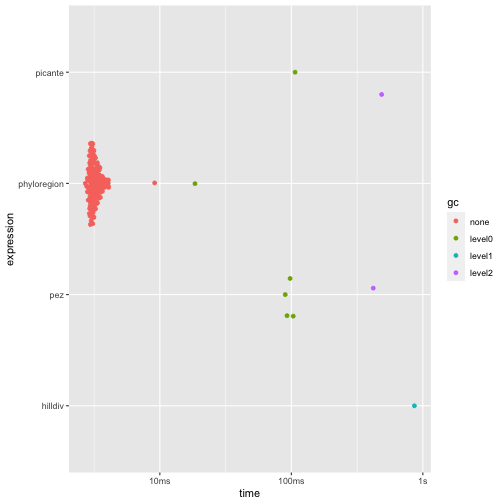
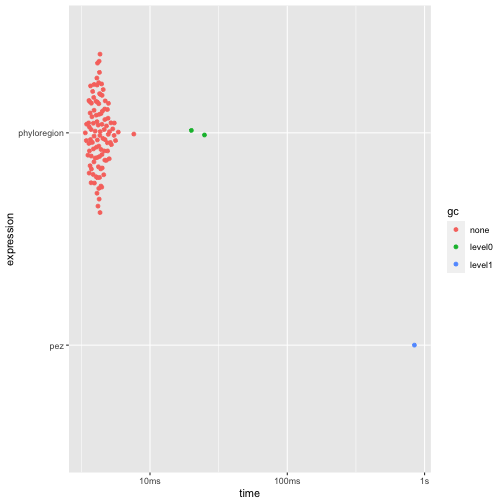
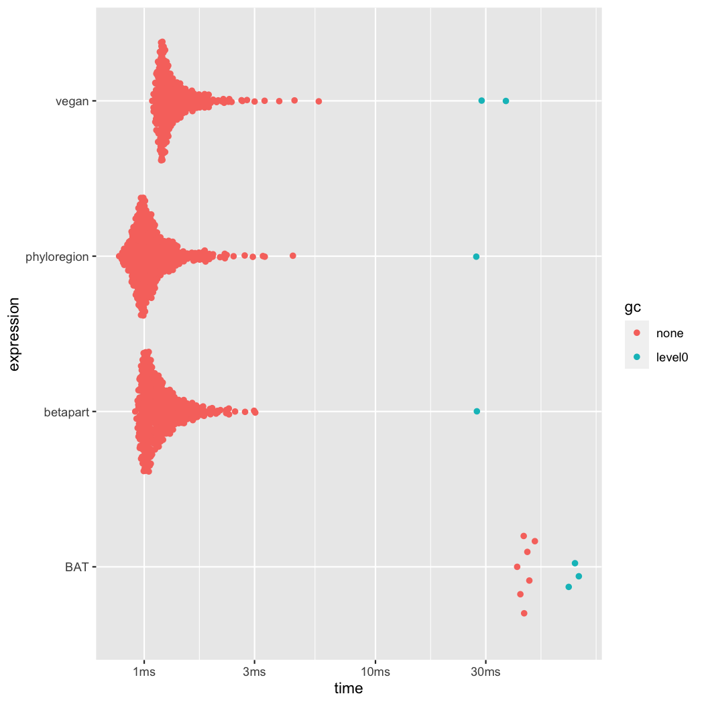
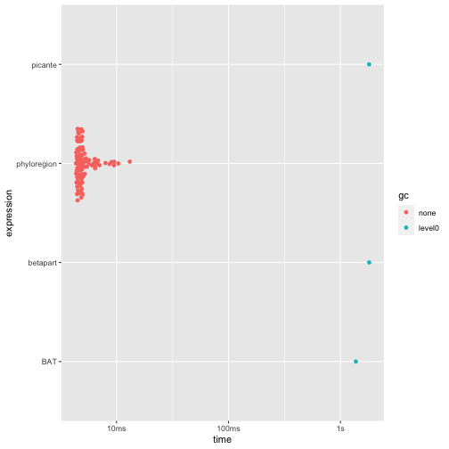

## Benchmarking `phyloregion` against other packages

In this vignette, we benchmark `phyloregion` against other similar `R`
packages in analyses of standard alpha diversity metrics commonly
used in conservation, such as phylogenetic diversity and phylogenetic
endemism as well as metrics for analyzing compositional turnover (e.g.,
beta diversity and phylogenetic beta diversity). Specifically, we
compare `phyloregion`'s functions with available packages for efficiency
in memory allocation and computation speed in various biogeographic analyses.

First, load the packages for the benchmarking:


```r
library(ape)
library(Matrix)
library(bench)
library(ggplot2)
# packages we benchmark
library(phyloregion)
library(betapart)
library(picante)
library(vegan)
library(hilldiv)
library(BAT)
library(pez)
```
We will use a small data set which comes with `phyloregion`.

```r
data(africa)
# subset matrix
X_sparse <- africa$comm[1:30, ]
X_sparse <- X_sparse[, colSums(X_sparse)>0]
X_dense <- as.matrix(X_sparse)
Xt_dense <- t(X_dense)

object.size(X_sparse)
```

```
## 76504 bytes
```

```r
object.size(X_dense)
```

```
## 134752 bytes
```

```r
dim(X_sparse)
```

```
## [1]  30 401
```
To make results comparable, it is often desirable to make sure
that the taxa in different datasets match each other. For example,

the community matrix in the `hilldiv` package needs to be transposed.
These transformations can influence the execution times, often only marginally.
To benchmark `phyloregion` against other packages, we here use the package `bench`
because it returns execution times and provides estimates of memory
allocations for each computation.

## 1. Analysis of alpha diversity
#### 1.1. Benchmarking `phyloregion` for analysis of phylogenetic diversity

For analysis of alpha diversity commonly used in conservation such as phylogenetic
diversity - the sum of all phylogenetic branch lengths within an area [@Faith1992]
(Faith 1992) - `phyloregion` is 31 to 284 times faster and 67 to 192 times
memory efficient, compared to other packages!

```r
tree <- africa$phylo
tree <- keep.tip(tree, colnames(X_sparse))

pd_picante <- function(x, tree){
    res <- picante::pd(x, tree)[,1]
    names(res) <- row.names(x)
    res
}

pd_pez <- function(x, tree){
    dat <- pez::comparative.comm(tree, x)
    res <- pez::.pd(dat)[,1]
    names(res) <- row.names(x)
    res
}

pd_hilldiv <- function(x, tree) hilldiv::index_div(x, tree, index="faith")
pd_phyloregion <- function(x, tree) phyloregion::PD(x, tree)

res1 <- bench::mark(picante=pd_picante(X_dense, tree),
          hilldiv=pd_hilldiv(Xt_dense,tree=tree),
          pez=pd_pez(X_dense, tree),
          phyloregion=pd_phyloregion(X_sparse, tree))
summary(res1)
```

```
## # A tibble: 4 x 6
##   expression       min   median `itr/sec` mem_alloc `gc/sec`
##   <bch:expr>  <bch:tm> <bch:tm>     <dbl> <bch:byt>    <dbl>
## 1 picante      99.95ms 115.45ms      8.89    59.5MB    16.0 
## 2 hilldiv     913.33ms 913.33ms      1.09  170.22MB     6.57
## 3 pez         103.53ms 108.35ms      9.22   60.79MB    16.6 
## 4 phyloregion   2.55ms   2.73ms    319.      1.86MB    12.0
```

```r
autoplot(res1)
```



#### 1.2. Benchmarking `phyloregion` for analysis of phylogenetic endemism

Another benchmark for `phyloregion` is in analysis of phylogenetic endemism, the
degree to which phylogenetic diversity is restricted to any given area [@Rosauer2009]. Here, we found that `phyloregion` is 160 times faster
and 489 times efficient in memory allocation.


```r
tree <- africa$phylo
tree <- keep.tip(tree, colnames(X_sparse))

pe_pez <- function(x, tree){
    dat <- pez::comparative.comm(tree, x)
    res <- pez::pez.endemism(dat)[,1]
    names(res) <- row.names(x)
    res
}

pe_phyloregion <- function(x, tree) phyloregion::phylo_endemism(x, tree)

res2 <- bench::mark(pez=pe_pez(X_dense, tree),
          phyloregion=pe_phyloregion(X_sparse, tree))
summary(res2)
```

```
## # A tibble: 2 x 6
##   expression       min   median `itr/sec` mem_alloc `gc/sec`
##   <bch:expr>  <bch:tm> <bch:tm>     <dbl> <bch:byt>    <dbl>
## 1 pez          584.3ms 584.26ms      1.71  498.93MB    15.4 
## 2 phyloregion    3.1ms   3.31ms    264.      1.08MB     6.00
```

```r
autoplot(res2)
```



## 2. Analysis of compositional turnover (beta diversity)
#### 2.1. Benchmarking `phyloregion` for analysis of taxonomic beta diversity

For analysis of taxonomic beta diversity, which compares diversity between
communities [@Koleff2003], `phyloregion` has marginal advantage
over other packages. Nonetheless, it is 1-39 times faster and allocates 2 to 110
times less memory than other packages.

```r
chk_fun <- function(target, current)
    all.equal(target, current, check.attributes = FALSE)

fun_phyloregion <- function(x) as.matrix(phyloregion::beta_diss(x)[[3]])
fun_betapart <- function(x) as.matrix(betapart::beta.pair(x)[[3]])
fun_vegan  <- function(x) as.matrix(vegan::vegdist(x, binary=TRUE))
fun_BAT <- function(x) as.matrix(BAT::beta(x, func = "Soerensen")[[1]])
res3 <- bench::mark(phyloregion=fun_phyloregion(X_sparse),
                    betapart=fun_betapart(X_dense),
                    vegan=fun_vegan(X_dense),
                    BAT=fun_BAT(X_dense), check=chk_fun)
summary(res3)
```

```
## # A tibble: 4 x 6
##   expression       min   median `itr/sec` mem_alloc `gc/sec`
##   <bch:expr>  <bch:tm> <bch:tm>     <dbl> <bch:byt>    <dbl>
## 1 phyloregion 730.31µs 819.97µs    1122.   418.77KB     5.16
## 2 betapart    877.58µs 961.12µs     974.   601.23KB     9.17
## 3 vegan         1.04ms   1.12ms     842.     1.02MB    20.3 
## 4 BAT          34.96ms  38.02ms      25.4   31.76MB    12.7
```

```r
autoplot(res3)
```



#### 2.2. Benchmarking `phyloregion` for analysis of phylogenetic beta diversity
For analysis phylogenetic turnover (beta-diversity) among communities - the
proportion of shared phylogenetic branch lengths between communities [@Graham2008] - `phyloregion` is 300-400 times faster and allocates 100-600 times less memory!

```r
fun_phyloregion <- function(x, tree) phyloregion::phylobeta(x, tree)[[3]]
fun_betapart <- function(x, tree) betapart::phylo.beta.pair(x, tree)[[3]]
fun_picante <- function(x, tree) 1 - picante::phylosor(x, tree)
fun_BAT <- function(x, tree) BAT::beta(x, tree, func = "Soerensen")[[1]]

chk_fun <- function(target, current)
    all.equal(target, current, check.attributes = FALSE)

res4 <- bench::mark(picante=fun_picante(X_dense, tree),
                       betapart=fun_betapart(X_dense, tree),
                       BAT=fun_BAT(X_dense, tree),
                       phyloregion=fun_phyloregion(X_sparse, tree), check=chk_fun)
summary(res4)
```

```
## # A tibble: 4 x 6
##   expression       min   median `itr/sec` mem_alloc `gc/sec`
##   <bch:expr>  <bch:tm> <bch:tm>     <dbl> <bch:byt>    <dbl>
## 1 picante        2.06s    2.06s     0.484    1.24GB    3.88 
## 2 betapart       3.62s    3.62s     0.277    1.24GB    1.38 
## 3 BAT            1.42s    1.42s     0.704  207.39MB    0.704
## 4 phyloregion    4.2ms   4.47ms   213.        1.1MB    0
```

```r
autoplot(res4)
```



Note that for this test, `picante` returns a similarity matrix while
`betapart`, and `phyloregion` return a dissimilarity matrix.

## Session Infomation

```r
sessionInfo()
```

```
## R version 3.6.1 (2019-07-05)
## Platform: x86_64-apple-darwin15.6.0 (64-bit)
## Running under: macOS Mojave 10.14.6
## 
## Matrix products: default
## BLAS:   /System/Library/Frameworks/Accelerate.framework/Versions/A/Frameworks/vecLib.framework/Versions/A/libBLAS.dylib
## LAPACK: /Library/Frameworks/R.framework/Versions/3.6/Resources/lib/libRlapack.dylib
## 
## locale:
## [1] en_US.UTF-8/en_US.UTF-8/en_US.UTF-8/C/en_US.UTF-8/en_US.UTF-8
## 
## attached base packages:
## [1] stats     graphics  grDevices utils     datasets  methods   base     
## 
## other attached packages:
##  [1] pez_1.2-0         BAT_2.0.0         hilldiv_1.5.1     picante_1.8.1    
##  [5] nlme_3.1-145      vegan_2.5-6       lattice_0.20-40   permute_0.9-5    
##  [9] betapart_1.5.1    phyloregion_1.0.0 ggplot2_3.3.0     bench_1.1.1      
## [13] Matrix_1.2-18     ape_5.3           knitr_1.28       
## 
## loaded via a namespace (and not attached):
##   [1] backports_1.1.5         Hmisc_4.3-1             BDgraph_2.62           
##   [4] fastmatch_1.1-0         plyr_1.8.6              igraph_1.2.4.2         
##   [7] sp_1.4-1                splines_3.6.1           crosstalk_1.0.0        
##  [10] digest_0.6.25           htmltools_0.4.0         fansi_0.4.1            
##  [13] phytools_0.6-99         magrittr_1.5            checkmate_2.0.0        
##  [16] tensor_1.5              cluster_2.1.0           ks_1.11.7              
##  [19] fastcluster_1.1.25      pdist_1.2               prettyunits_1.1.1      
##  [22] jpeg_0.1-8.1            colorspace_1.4-1        xfun_0.12              
##  [25] dplyr_0.8.5             crayon_1.3.4            jsonlite_1.6.1         
##  [28] spatstat.data_1.4-3     spatstat_1.63-3         survival_3.1-11        
##  [31] phangorn_2.5.5          glue_1.3.2              apTreeshape_1.5-0      
##  [34] polyclip_1.10-0         gtable_0.3.0            geiger_2.0.6.4         
##  [37] MatrixModels_0.4-1      webshot_0.5.2           maps_3.3.0             
##  [40] SparseM_1.78            abind_1.4-5             scales_1.1.0           
##  [43] mvtnorm_1.1-0           miniUI_0.1.1.1          Rcpp_1.0.3             
##  [46] plotrix_3.7-7           xtable_1.8-4            progress_1.2.2         
##  [49] htmlTable_1.13.3        magic_1.5-9             foreign_0.8-76         
##  [52] subplex_1.6             mclust_5.4.5            deSolve_1.28           
##  [55] Formula_1.2-3           stats4_3.6.1            animation_2.6          
##  [58] htmlwidgets_1.5.1       RColorBrewer_1.1-2      lavaan_0.6-5           
##  [61] acepack_1.4.1           farver_2.0.3            pkgconfig_2.0.3        
##  [64] deldir_0.1-25           nnet_7.3-13             utf8_1.1.4             
##  [67] tidyselect_1.0.0        rlang_0.4.5             manipulateWidget_0.10.1
##  [70] reshape2_1.4.3          later_1.0.0             munsell_0.5.0          
##  [73] tools_3.6.1             cli_2.0.2               ade4_1.7-15            
##  [76] FD_1.0-12               fdrtool_1.2.15          evaluate_0.14          
##  [79] geometry_0.4.5          stringr_1.4.0           fastmap_1.0.1          
##  [82] goftest_1.2-2           yaml_2.2.1              rgl_0.100.50           
##  [85] purrr_0.3.3             glasso_1.11             pbapply_1.4-2          
##  [88] quantreg_5.54           whisker_0.4             mime_0.9               
##  [91] profmem_0.5.0           compiler_3.6.1          rstudioapi_0.11        
##  [94] beeswarm_0.2.3          png_0.1-7               e1071_1.7-3            
##  [97] ggsignif_0.6.0          spatstat.utils_1.17-0   clusterGeneration_1.3.4
## [100] huge_1.3.4              tibble_2.1.3            pbivnorm_0.6.0         
## [103] stringi_1.4.6           highr_0.8               qgraph_1.6.5           
## [106] cubature_2.0.4          rgeos_0.5-2             psych_1.9.12.31        
## [109] vctrs_0.2.4             pillar_1.4.3            lifecycle_0.2.0        
## [112] combinat_0.0-8          caper_1.0.1             data.table_1.12.8      
## [115] corpcor_1.6.9           raster_3.0-12           httpuv_1.5.2           
## [118] R6_2.4.1                latticeExtra_0.6-29     promises_1.1.0         
## [121] KernSmooth_2.23-16      gridExtra_2.3           vipor_0.4.5            
## [124] codetools_0.2-16        rcdd_1.2-2              MASS_7.3-51.5          
## [127] gtools_3.8.1            assertthat_0.2.1        rjson_0.2.20           
## [130] withr_2.1.2             mnormt_1.5-6            expm_0.999-4           
## [133] mgcv_1.8-31             parallel_3.6.1          hms_0.5.3              
## [136] quadprog_1.5-8          grid_3.6.1              rpart_4.1-15           
## [139] tidyr_1.0.2             coda_0.19-3             class_7.3-15           
## [142] rmarkdown_2.1           nls2_0.2                FSA_0.8.30             
## [145] hypervolume_2.0.12      d3Network_0.5.2.1       ggpubr_0.2.5           
## [148] scatterplot3d_0.3-41    numDeriv_2016.8-1.1     shiny_1.4.0.1          
## [151] base64enc_0.1-3         ggbeeswarm_0.6.0
```

## REFERENCES
