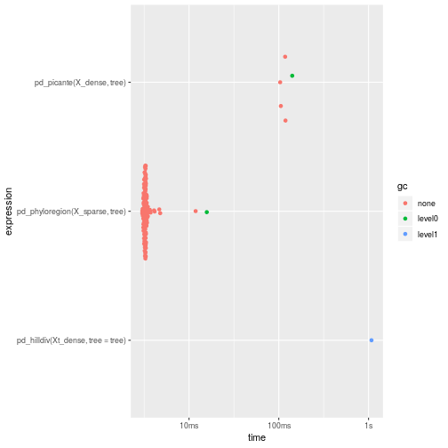
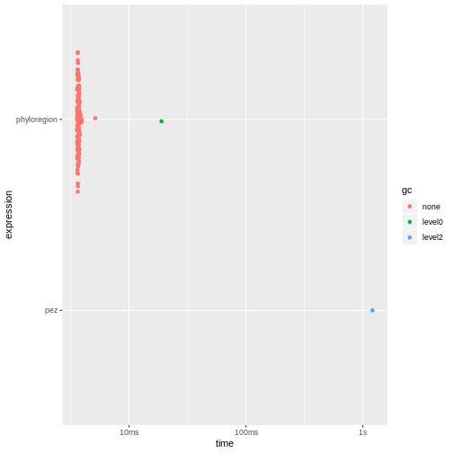
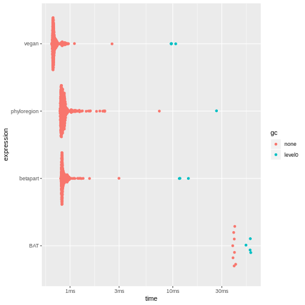
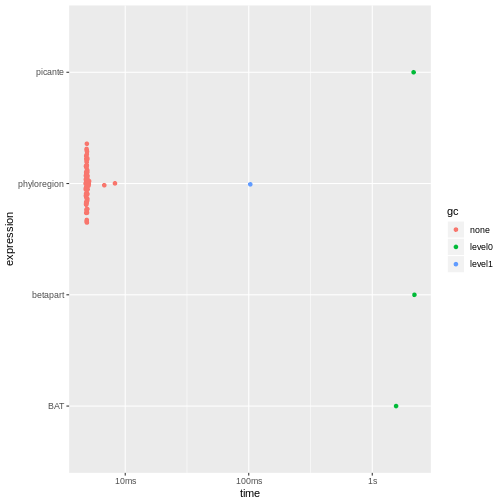

## Benchmarking `phyloregion` against other packages

In this vignette, we benchmark `phyloregion` against other similar `R`
packages in analyses of standard alpha diversity metrics commonly
used in conservation, such as phylogenetic diversity and phylogenetic
endemism as well as metrics for analyzing compositional turnover (e.g.,
beta diversity and phylogenetic beta diversity). Specifically, we
compare `phyloregion`'s functions with available packages for efficiency
in memory allocation and computation speed in various biogeographic analyses.

First, load the packages for the benchmarking:


```r
library(ape)
library(Matrix)
library(bench)
library(ggplot2)
# packages we benchmark
library(phyloregion)
library(betapart)
library(picante)
library(vegan)
library(hilldiv)
library(BAT)
library(pez)
```
We will use a small data set which comes with `phyloregion`.

```r
data(africa)
# subset matrix
X_sparse <- africa$comm[1:30, ]
X_sparse <- X_sparse[, colSums(X_sparse)>0]
X_dense <- as.matrix(X_sparse)
Xt_dense <- t(X_dense)

object.size(X_sparse)
```

```
## 76504 bytes
```

```r
object.size(X_dense)
```

```
## 134752 bytes
```

```r
dim(X_sparse)
```

```
## [1]  30 401
```
To make results comparable, it is often desirable to make sure
that the taxa in different datasets match each other. For example,

the community matrix in the `hilldiv` package needs to be transposed.
These transformations can influence the execution times, often only marginally.
To benchmark `phyloregion` against other packages, we here use the package `bench`
because it returns execution times and provides estimates of memory
allocations for each computation.

## 1. Analysis of alpha diversity
#### 1.1. Benchmarking `phyloregion` for analysis of phylogenetic diversity

For analysis of alpha diversity commonly used in conservation such as phylogenetic
diversity - the sum of all phylogenetic branch lengths within an area [@Faith1992]
(Faith 1992) - `phyloregion` is 31 to 284 times faster and 67 to 192 times
memory efficient, compared to other packages!

```r
tree <- africa$phylo
tree <- keep.tip(tree, colnames(X_sparse))

pd_picante <- function(x, tree){
    res <- picante::pd(x, tree)[,1]
    names(res) <- row.names(x)
    res
}

pd_pez <- function(x, tree){
    dat <- pez::comparative.comm(tree, x)
    res <- pez::.pd(dat)[,1]
    names(res) <- row.names(x)
    res
}

pd_hilldiv <- function(x, tree) hilldiv::index_div(x, tree, index="faith")
pd_phyloregion <- function(x, tree) phyloregion::PD(x, tree)

res1 <- bench::mark(picante=pd_picante(X_dense, tree),
          hilldiv=pd_hilldiv(Xt_dense,tree=tree),
          pez=pd_pez(X_dense, tree),
          phyloregion=pd_phyloregion(X_sparse, tree))
```

```
## Warning: Some expressions had a GC in every iteration; so filtering is disabled.
```

```r
summary(res1)
```

```
## Warning: Some expressions had a GC in every iteration; so filtering is disabled.
```

```
## Registered S3 method overwritten by 'cli':
##   method     from    
##   print.boxx spatstat
```

```
## # A tibble: 4 x 6
##   expression       min   median `itr/sec` mem_alloc `gc/sec`
##   <bch:expr>  <bch:tm> <bch:tm>     <dbl> <bch:byt>    <dbl>
## 1 picante     118.16ms 127.92ms     7.90     59.5MB    17.8 
## 2 hilldiv        1.26s    1.26s     0.795  170.22MB     4.77
## 3 pez         130.67ms 136.54ms     7.31    60.78MB    14.6 
## 4 phyloregion   3.06ms   3.16ms   284.       1.86MB     7.99
```

```r
autoplot(res1)
```

```
## Loading required namespace: tidyr
```



#### 1.2. Benchmarking `phyloregion` for analysis of phylogenetic endemism

Another benchmark for `phyloregion` is in analysis of phylogenetic endemism, the
degree to which phylogenetic diversity is restricted to any given area [@Rosauer2009]. Here, we found that `phyloregion` is 160 times faster
and 489 times efficient in memory allocation.


```r
tree <- africa$phylo
tree <- keep.tip(tree, colnames(X_sparse))

pe_pez <- function(x, tree){
    dat <- pez::comparative.comm(tree, x)
    res <- pez::pez.endemism(dat)[,1]
    names(res) <- row.names(x)
    res
}

pe_phyloregion <- function(x, tree) phyloregion::phylo_endemism(x, tree)

res2 <- bench::mark(pez=pe_pez(X_dense, tree),
          phyloregion=pe_phyloregion(X_sparse, tree))
```

```
## Warning: Some expressions had a GC in every iteration; so filtering is disabled.
```

```r
summary(res2)
```

```
## Warning: Some expressions had a GC in every iteration; so filtering is disabled.
```

```
## # A tibble: 2 x 6
##   expression       min   median `itr/sec` mem_alloc `gc/sec`
##   <bch:expr>  <bch:tm> <bch:tm>     <dbl> <bch:byt>    <dbl>
## 1 pez            1.21s    1.21s     0.826  498.93MB     6.61
## 2 phyloregion   3.57ms   3.67ms   263.       1.08MB     1.99
```

```r
autoplot(res2)
```



## 2. Analysis of compositional turnover (beta diversity)
#### 2.1. Benchmarking `phyloregion` for analysis of taxonomic beta diversity

For analysis of taxonomic beta diversity, which compares diversity between
communities [@Koleff2003], `phyloregion` has marginal advantage
over other packages. Nonetheless, it is 1-39 times faster and allocates 2 to 110
times less memory than other packages.

```r
chk_fun <- function(target, current)
    all.equal(target, current, check.attributes = FALSE)

fun_phyloregion <- function(x) as.matrix(phyloregion::beta_diss(x)[[3]])
fun_betapart <- function(x) as.matrix(betapart::beta.pair(x)[[3]])
fun_vegan  <- function(x) as.matrix(vegan::vegdist(x, binary=TRUE))
fun_BAT <- function(x) as.matrix(BAT::beta(x, func = "Soerensen")[[1]])
res3 <- bench::mark(phyloregion=fun_phyloregion(X_sparse),
                    betapart=fun_betapart(X_dense),
                    vegan=fun_vegan(X_dense),
                    BAT=fun_BAT(X_dense), check=chk_fun)
summary(res3)
```

```
## # A tibble: 4 x 6
##   expression       min   median `itr/sec` mem_alloc `gc/sec`
##   <bch:expr>  <bch:tm> <bch:tm>     <dbl> <bch:byt>    <dbl>
## 1 phyloregion  796.1µs  848.1µs    1113.   418.81KB     2.12
## 2 betapart       810µs  841.2µs    1149.   601.23KB     6.49
## 3 vegan        664.1µs  691.4µs    1390.     1.02MB     8.69
## 4 BAT           38.3ms   39.6ms      25.3   31.76MB    12.7
```

```r
autoplot(res3)
```



#### 2.2. Benchmarking `phyloregion` for analysis of phylogenetic beta diversity
For analysis phylogenetic turnover (beta-diversity) among communities - the
proportion of shared phylogenetic branch lengths between communities [@Graham2008] - `phyloregion` is 300-400 times faster and allocates 100-600 times less memory!

```r
fun_phyloregion <- function(x, tree) phyloregion::phylobeta(x, tree)[[3]]
fun_betapart <- function(x, tree) betapart::phylo.beta.pair(x, tree)[[3]]
fun_picante <- function(x, tree) 1 - picante::phylosor(x, tree)
fun_BAT <- function(x, tree) BAT::beta(x, tree, func = "Soerensen")[[1]]

chk_fun <- function(target, current)
    all.equal(target, current, check.attributes = FALSE)

res4 <- bench::mark(picante=fun_picante(X_dense, tree),
                       betapart=fun_betapart(X_dense, tree),
                       BAT=fun_BAT(X_dense, tree),
                       phyloregion=fun_phyloregion(X_sparse, tree), check=chk_fun)
```

```
## Warning: Some expressions had a GC in every iteration; so filtering is disabled.
```

```r
summary(res4)
```

```
## Warning: Some expressions had a GC in every iteration; so filtering is disabled.
```

```
## # A tibble: 4 x 6
##   expression       min   median `itr/sec` mem_alloc `gc/sec`
##   <bch:expr>  <bch:tm> <bch:tm>     <dbl> <bch:byt>    <dbl>
## 1 picante        2.16s    2.16s     0.463    1.24GB    2.31 
## 2 betapart       2.19s    2.19s     0.456    1.24GB    2.74 
## 3 BAT            1.56s    1.56s     0.641  207.39MB    0.641
## 4 phyloregion   4.78ms   4.89ms   163.        1.1MB    1.98
```

```r
autoplot(res4)
```



Note that for this test, `picante` returns a similarity matrix while
`betapart`, and `phyloregion` return a dissimilarity matrix.

## Session Infomation

```r
sessionInfo()
```

```
## R version 3.6.3 (2020-02-29)
## Platform: x86_64-pc-linux-gnu (64-bit)
## Running under: Ubuntu 19.10
## 
## Matrix products: default
## BLAS:   /usr/lib/x86_64-linux-gnu/blas/libblas.so.3.8.0
## LAPACK: /usr/lib/x86_64-linux-gnu/lapack/liblapack.so.3.8.0
## 
## locale:
##  [1] LC_CTYPE=de_AT.UTF-8       LC_NUMERIC=C               LC_TIME=de_AT.UTF-8       
##  [4] LC_COLLATE=de_AT.UTF-8     LC_MONETARY=de_AT.UTF-8    LC_MESSAGES=de_AT.UTF-8   
##  [7] LC_PAPER=de_AT.UTF-8       LC_NAME=C                  LC_ADDRESS=C              
## [10] LC_TELEPHONE=C             LC_MEASUREMENT=de_AT.UTF-8 LC_IDENTIFICATION=C       
## 
## attached base packages:
## [1] stats     graphics  grDevices utils     datasets  methods   base     
## 
## other attached packages:
##  [1] pez_1.2-0         BAT_2.0.0         hilldiv_1.5.1     picante_1.8.1     nlme_3.1-144     
##  [6] vegan_2.5-6       lattice_0.20-40   permute_0.9-5     betapart_1.5.1    phyloregion_0.1.0
## [11] ggplot2_3.2.1     bench_1.1.1       Matrix_1.2-18     ape_5.3           knitr_1.28       
## 
## loaded via a namespace (and not attached):
##   [1] backports_1.1.5         Hmisc_4.3-1             BDgraph_2.62           
##   [4] fastmatch_1.1-0         plyr_1.8.6              igraph_1.2.4.2         
##   [7] lazyeval_0.2.2          sp_1.4-1                splines_3.6.3          
##  [10] crosstalk_1.0.0         digest_0.6.25           htmltools_0.4.0        
##  [13] fansi_0.4.1             phytools_0.6-99         magrittr_1.5           
##  [16] checkmate_2.0.0         tensor_1.5              cluster_2.1.0          
##  [19] ks_1.11.7               fastcluster_1.1.25      pdist_1.2              
##  [22] prettyunits_1.1.1       jpeg_0.1-8.1            colorspace_1.4-1       
##  [25] xfun_0.12               dplyr_0.8.4             crayon_1.3.4           
##  [28] jsonlite_1.6.1          spatstat_1.63-3         spatstat.data_1.4-3    
##  [31] survival_3.1-8          phangorn_2.5.5          glue_1.3.1             
##  [34] apTreeshape_1.5-0       polyclip_1.10-0         gtable_0.3.0           
##  [37] geiger_2.0.6.4          MatrixModels_0.4-1      webshot_0.5.2          
##  [40] maps_3.3.0              SparseM_1.78            abind_1.4-5            
##  [43] scales_1.1.0            mvtnorm_1.1-0           miniUI_0.1.1.1         
##  [46] Rcpp_1.0.3              plotrix_3.7-7           xtable_1.8-4           
##  [49] progress_1.2.2          htmlTable_1.13.3        magic_1.5-9            
##  [52] foreign_0.8-75          subplex_1.6             mclust_5.4.5           
##  [55] deSolve_1.27.1          Formula_1.2-3           stats4_3.6.3           
##  [58] animation_2.6           htmlwidgets_1.5.1       RColorBrewer_1.1-2     
##  [61] lavaan_0.6-5            acepack_1.4.1           farver_2.0.3           
##  [64] pkgconfig_2.0.3         deldir_0.1-25           nnet_7.3-13            
##  [67] utf8_1.1.4              tidyselect_1.0.0        rlang_0.4.5            
##  [70] manipulateWidget_0.10.1 reshape2_1.4.3          later_1.0.0            
##  [73] munsell_0.5.0           tools_3.6.3             cli_2.0.2              
##  [76] ade4_1.7-15             FD_1.0-12               fdrtool_1.2.15         
##  [79] evaluate_0.14           geometry_0.4.5          stringr_1.4.0          
##  [82] fastmap_1.0.1           goftest_1.2-2           rgl_0.100.50           
##  [85] purrr_0.3.3             glasso_1.11             pbapply_1.4-2          
##  [88] quantreg_5.54           whisker_0.4             mime_0.9               
##  [91] profmem_0.5.0           compiler_3.6.3          rstudioapi_0.11        
##  [94] beeswarm_0.2.3          png_0.1-7               e1071_1.7-3            
##  [97] ggsignif_0.6.0          spatstat.utils_1.17-0   clusterGeneration_1.3.4
## [100] huge_1.3.4              tibble_2.1.3            pbivnorm_0.6.0         
## [103] stringi_1.4.6           highr_0.8               qgraph_1.6.5           
## [106] cubature_2.0.4          rgeos_0.5-2             psych_1.9.12.31        
## [109] vctrs_0.2.3             pillar_1.4.3            lifecycle_0.1.0        
## [112] combinat_0.0-8          caper_1.0.1             data.table_1.12.8      
## [115] corpcor_1.6.9           raster_3.0-12           httpuv_1.5.2           
## [118] R6_2.4.1                latticeExtra_0.6-29     promises_1.1.0         
## [121] KernSmooth_2.23-16      gridExtra_2.3           vipor_0.4.5            
## [124] codetools_0.2-16        rcdd_1.2-2              MASS_7.3-51.5          
## [127] gtools_3.8.1            assertthat_0.2.1        rjson_0.2.20           
## [130] withr_2.1.2             mnormt_1.5-6            expm_0.999-4           
## [133] mgcv_1.8-31             parallel_3.6.3          hms_0.5.3              
## [136] quadprog_1.5-8          grid_3.6.3              rpart_4.1-15           
## [139] tidyr_1.0.2             coda_0.19-3             class_7.3-15           
## [142] nls2_0.2                FSA_0.8.27              hypervolume_2.0.12     
## [145] d3Network_0.5.2.1       ggpubr_0.2.5            scatterplot3d_0.3-41   
## [148] numDeriv_2016.8-1.1     shiny_1.4.0             base64enc_0.1-3        
## [151] ggbeeswarm_0.6.0
```

## REFERENCES
