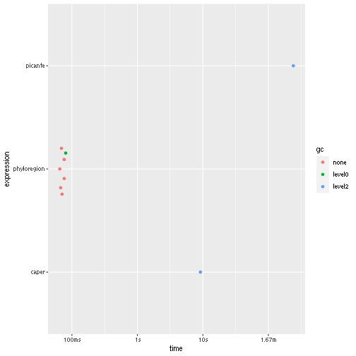

## Introduction

Evolutionary distinctiveness is a metric that quantifies how isolated a species
is on a phylogenetic tree – some species have few or no close living relatives.

The standard method for calculating evolutionary distinctiveness is either by using the `R` packages `picante` or `caper`. For very large trees, such calculation is a memory-intensive operation and a bottle-neck for these
algorithms.

Because of these challenges, we developed a new method in our `phyloregion` package that speeds up the process significantly to produce results in seconds! See how:

Let's try computing evolutionary distinctiveness for a tree with 5,000 species:


```r
library(ape)
library(ggplot2)
# packages we benchmark
library(phyloregion)
library(picante)
library(caper)
```


```r
tree <- ape::rcoal(5000)

ed_picante <- function(x) picante::evol.distinct(x, type="fair.proportion")
ed_caper <- function(x) caper::ed.calc(x)
ed_phyloregion <- function(x) phyloregion::evol_distinct(x, type="fair.proportion")

res <- bench::mark(picante=ed_picante(tree),
          caper=ed_caper(tree),
          phyloregion=ed_phyloregion(tree), check=FALSE)
summary(res)
```

```
## # A tibble: 3 × 6
##   expression       min   median `itr/sec` mem_alloc `gc/sec`
##   <bch:expr>  <bch:tm> <bch:tm>     <dbl> <bch:byt>    <dbl>
## 1 picante        4.02m    4.02m   0.00415        NA    18.9 
## 2 caper          9.17s    9.17s   0.109          NA     5.45
## 3 phyloregion   65.3ms  70.56ms  13.9            NA     1.98
```

```r
autoplot(res)
```


Here, `phyloregion` is several orders of magnitude faster and efficient in
memory allocation than the other packages.

The function in `phyloreegion` is called `evol_distinct` and it is used as
follows:


```r
evol_distinct(tree, type = c("equal.splits", "fair.proportion"), ...)
```

If you find this vignette tutorial useful, please cite in publications as:

Daru, B.H., Karunarathne, P. & Schliep, K. (2020) phyloregion: R package for biogeographic regionalization and macroecology. **_Methods in Ecology and Evolution_** __11__: 1483-1491. [doi: 10.1111/2041-210X.13478](https://doi.org/10.1111/2041-210X.13478).


