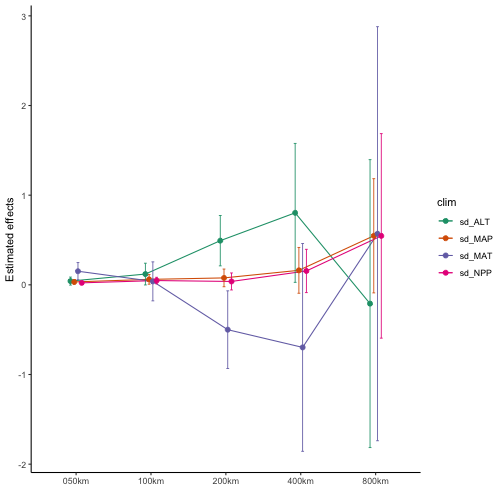
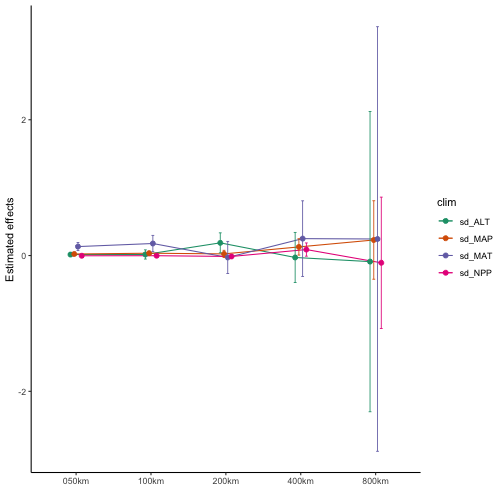
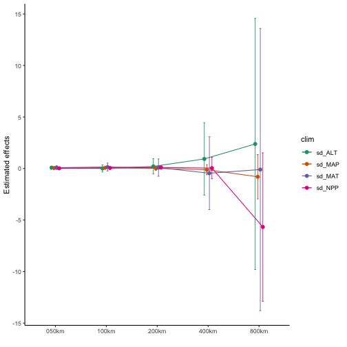
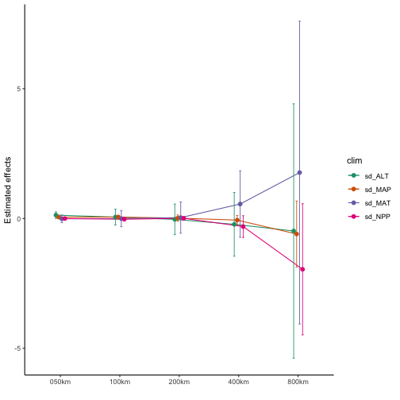

## 1. Environmental data

We selected key environmental factors that are commonly used to examine
biodiversity-environment associations. These variables included mean annual
temperature (temperature henceforth), mean annual precipitation (precipitation
henceforth), annual net primary productivity (productivity henceforth) and
elevation.

Temperature, precipitation and elevation were downloaded as raster
layers from the WorldClim database [@Hijmans2005] at a resolution of 2.5’.
Productivity was downloaded from NASA Moderate Resolution Imaging Spectroradiometer
(MODIS) at a resolution of 1 km and calculated using the MOD17 algorithm. These
variables were converted to Behrmann equal-area projection using the function
`projectRaster` in the R package `raster` [@raster].

## 2. Environmental heterogeneity

To measure environmental heterogeneity, for each cell and across grain sizes (50 km,
100 km, 200 km, 400 km and 800 km), we extracted the standard deviation of the
four environmental variables (temperature, precipitation, elevation and productivity)
using the function `extract_climate` in the R package `phyloregionExtras`
[@phyloregionExtras]:


```r
extract_climate <- function(x, y, val = "val", FUN = sd, ...){
  x <- raster::projectRaster(x, crs = ('+proj=longlat'))
  ras <- raster::projectRaster(x, crs = proj4string(y), over = TRUE)
  p <- raster::extract(ras, y, ...)
  m <- unlist(lapply(p, function(x) if (!is.null(x)) FUN(x, na.rm = TRUE) else NA))
  y$foo <- m
  names(y)[match("foo", names(y))] <- val
  y
}

######### Arguments #######################
# x: A raster file of the environmental variable
# y: Spatial polygons corresponding to the study area to extract the variable.
# val: String to rename the column with the extracted variable.
# FUN: The function to summarize the values (e.g. sd, mean)
```

## 3. Mixed effects models analysis

We compared the performance of two models: standard linear models, and linear mixed
effects model. The goodness of fit of the models was selected by the Akaike
Information Criterion (AIC)[@pinheiro2006] using our R function
`clim_heterogeneity` with `aic` set to `TRUE`.

The linear mixed effects model outperforms the standard linear model as suggested
by the values of AIC and was used for the next analyses.

We performed a linear mixed-effects models at each scale to analyse the relationship
between endemism (PE or WE) and environmental variables, taking into account
the spatial structure of the patterns.

A linear mixed effects model allows the modeling of data as an additive combination of
fixed effects (unknown mean and coefficients of a model), random effects
(the spatially dependent random variation in the geostatistical context) and
independent random error (variation in geostatistics) [@Lark2006].
The form of a mixed effect model is expressed as:
$$Y_i = x_i\beta + s_i + Ɛ_i$$
where $Y_i$ represents the response variable at grid cell or location $i$, $x_i$ is a
vector containing spatially referenced nonrandom predictors, and $\beta$ is a vector
of the fixed effect parameters, $s_i$ is a spatially correlated random effect and $Ɛ_i$
is the random measurement error.

Endemism (phylogenetic endemism or weighted endemism) was used as the primary
(response) variable in the spatial models, whereas the standard deviation of
the four environmental variables (temperature, precipitation, elevation and
productivity) were used as covariates, including geographical Cartesian
$x/y-$ coordinates (longitude and latitude). This spatial structure was created
as a matrix of coordinates of each cell’s centroid, and we computed Euclidean
distances and weights of neighbouring points (function `dnearneigh` in R
package `spdep` [@spdep]) for the spatial autocorrelation analysis. Thus, the
autocovariate was included as an additional variable along with the standard
deviation of temperature, precipitation, elevation, and productivity whereas
grid cell identity was included as a random covariate. The linear mixed effects
modeling was done with the function `lme` in R package `nlme` [@nlme].

In order to illustrate the process we have added all codes below for the analyses:

First, load the packages for the analysis:


```r
library(spdep)
library(ggplot2)
library(nlme)
```


```r
# Function for computing environmental heterogeneity
clim_heterogeneity <- function (x, y = "y", nbs = 2e+07, x1 = "x1", x2 = "x2",
                                x3 = "x3", x4 = "x4", lon = "lon", lat = "lat",
                                grids = "grids", aic = FALSE)
{
    x <- as.data.frame(x)
    x <- x[complete.cases(x), ]
    x <- x[, c(y, x1, x2, x3, x4, lon, lat, grids)]
    names(x) <- c("y", "x1", "x2", "x3", "x4", "lon", "lat", "grids")
    x$y <- log(x$y + 1)
    x$x1 <- log(x$x1 + 1)
    x$x2 <- log(x$x2 + 1)
    x$x3 <- log(x$x3 + 1)
    x$x4 <- log(x$x4 + 1)
    m <- as.matrix(x[, c(lon, lat)])
    x$ac <- autocov_dist(x$y, m, nbs = nbs, type = "inverse.squared", zero.policy = TRUE)
    mod_lme <- nlme::lme(y ~ x1 + x2 + x3 + x4 + ac, random = ~1 | grids, data = x)
    mod_lm <- stats::lm(y ~ x1 + x3 + x3 + x4 + ac, data = x)
    aic.out = AIC(mod_lme, mod_lm)
    df <- data.frame(nlme::intervals(mod_lme)$fixed)
    fm <- nlme::anova.lme(mod_lme, type = "marginal")$"p-value"
    res <- cbind(df, p_val = fm)
    res <- res[!rownames(res) %in% c("(Intercept)", "ac"), ]
    rownames(res) <- c(x1, x2, x3, x4)
    res <- data.frame(clim = row.names(res), res, row.names = NULL)
    if (aic == TRUE) {
        return(list(random_est=res, AIC=aic.out, mod_lm=mod_lm, mod_lme=mod_lme))
    }
    return(res)
}


################################ Arguments ####################################
# x: A data.frame
# y: A response variable
# nbs: Neighbourhood distance
# x1..x4 An explanatory variables corresponding to environmental variables
# lon: Column name of the longitude.
# lat: Column name of the latitude.
# grids: Column name of the column containing grid cells
# aic: Show full models both lme and lm including their AICs.

fun1 <- function(x){
    res <- strsplit(x, "\\/")[[1]]
    res <- res[[length(res)]]
    res <- strsplit(res, "\\_")[[1]][2]
    res <- gsub(".csv", "", res)
    res
}


# Download the data frames from Dropbox and save in temporary folder
dir = tempdir()
setwd(dir)
download.file(url = "https://github.com/darunabas/extras/archive/master.zip",
              destfile = "extras-master.zip")
unzip(zipfile = "extras-master.zip")
setwd(dir = "extras-master")
list.files()
```

```
## [1] "environment" "mergedSA"    "shapefile"
```

```r
t1 <- list.files('environment/birds/WE', pattern="*.csv", full.names=TRUE)
t2 <- list.files('environment/birds/PE', pattern="*.csv", full.names=TRUE)
t3 <- list.files('environment/amphibians/WE', pattern="*.csv", full.names=TRUE)
t4 <- list.files('environment/amphibians/PE', pattern="*.csv", full.names=TRUE)

f1 <- unlist(lapply(t1, fun1))
f2 <- unlist(lapply(t2, fun1))
f3 <- unlist(lapply(t3, fun1))
f4 <- unlist(lapply(t4, fun1))

# load the data frames for each grain size
d1 <- lapply(t1, function(x) read.csv(x, stringsAsFactors = FALSE))
d2 <- lapply(t2, function(x) read.csv(x, stringsAsFactors = FALSE))
d3 <- lapply(t3, function(x) read.csv(x, stringsAsFactors = FALSE))
d4 <- lapply(t4, function(x) read.csv(x, stringsAsFactors = FALSE))

head(d1[[1]])
```

```
##    grids        WE    sd_ALT    sd_MAP   sd_MAT       sd_NPP      lon      lat
## 1 v10084  340.2460  562.8624   71.9370 3.848896  15284319418 -7052646 -1737713
## 2 v10088  606.7684  404.9584   50.2280 2.356266  32349944611 -6852646 -1737713
## 3 v10089 1143.1800  767.3688  395.3724 3.936351  18044787059 -6802646 -1737713
## 4 v10090 1437.5099 1187.8156 1062.3708 5.590839  63536778570 -6752646 -1737713
## 5 v10091 1488.2875  348.5838  380.4115 1.503277 203536278064 -6702646 -1737713
## 6 v10092  867.2580  398.0916  191.2684 1.678670   3244896302 -6652646 -1737713
```

## 4. Visualisation of results
### 4.1. Environmental heterogeneity and bird weighted endemism

```r
spo <- lapply(d1, function(x) clim_heterogeneity(x, y = "WE", x1 = "sd_ALT",
                                                 x2 = "sd_MAP", x3 = "sd_MAT",
                                                 x4 = "sd_NPP", nbs = 2000000))
ll <- lengths(spo)-1
z1 <- data.frame(do.call("rbind", spo), scale=rep(f1, ll))

pd <- position_dodge(width = 0.2)

ggplot(z1, aes(x=scale, y=est., group=clim, color=clim)) +
    geom_line(position = pd) +
    geom_point(size = 2, position = pd)+
    geom_errorbar(aes(ymax = upper, ymin = lower),
                  size  = .4,
                  width = .15,
                  position = pd)+
    theme_classic() +
    scale_color_manual(values=c('#1b9e77','#d95f02', "#7570b3", "#e7298a"))+
    labs(x = "", y = "Estimated effects")
```



### 4.2. Environmental heterogeneity and bird phylogenetic endemism

```r
spo <- lapply(d2, function(x) clim_heterogeneity(x, y = "PE", x1 = "sd_ALT",
                                                 x2 = "sd_MAP", x3 = "sd_MAT",
                                                 x4 = "sd_NPP"))
ll <- lengths(spo)-1
z1 <- data.frame(do.call("rbind", spo), scale=rep(f2, ll))

pd <- position_dodge(width = 0.2)

ggplot(z1, aes(x=scale, y=est., group=clim, color=clim)) +
    geom_line(position = pd) +
    geom_point(size = 2, position = pd)+
    geom_errorbar(aes(ymax = upper, ymin = lower),
                  size  = .4,
                  width = .15,
                  position = pd)+
    theme_classic() +
    scale_color_manual(values=c('#1b9e77','#d95f02', "#7570b3", "#e7298a"))+
    labs(x = "", y = "Estimated effects")
```



### 4.3. Environmental heterogeneity and amphibian weighted endemism

```r
spo <- lapply(d3, function(x) clim_heterogeneity(x, y = "WE", x1 = "sd_ALT",
                                                 x2 = "sd_MAP", x3 = "sd_MAT",
                                                 x4 = "sd_NPP"))
ll <- lengths(spo)-1
z1 <- data.frame(do.call("rbind", spo), scale=rep(f3, ll))

pd <- position_dodge(width = 0.2)

ggplot(z1, aes(x=scale, y=est., group=clim, color=clim)) +
    geom_line(position = pd) +
    geom_point(size = 2, position = pd)+
    geom_errorbar(aes(ymax = upper, ymin = lower),
                  size  = .4,
                  width = .15,
                  position = pd)+
    theme_classic() +
    scale_color_manual(values=c('#1b9e77','#d95f02', "#7570b3", "#e7298a"))+
    labs(x = "", y = "Estimated effects")
```



### 4.4. Environmental heterogeneity and amphibian phylogenetic endemism

```r
spo <- lapply(d4, function(x) clim_heterogeneity(x, y = "PE", x1 = "sd_ALT",
                                                 x2 = "sd_MAP", x3 = "sd_MAT",
                                                 x4 = "sd_NPP"))
ll <- lengths(spo)-1
z1 <- data.frame(do.call("rbind", spo), scale=rep(f4, ll))

pd <- position_dodge(width = 0.2)

ggplot(z1, aes(x=scale, y=est., group=clim, color=clim)) +
    geom_line(position = pd) +
    geom_point(size = 2, position = pd)+
    geom_errorbar(aes(ymax = upper, ymin = lower),
                  size  = .4,
                  width = .15,
                  position = pd)+
    theme_classic() +
    scale_color_manual(values=c('#1b9e77','#d95f02', "#7570b3", "#e7298a"))+
    labs(x = "", y = "Estimated effects")
```




## Session Infomation

```r
sessionInfo()
```

```
## R version 3.6.1 (2019-07-05)
## Platform: x86_64-apple-darwin15.6.0 (64-bit)
## Running under: macOS Mojave 10.14.6
## 
## Matrix products: default
## BLAS:   /System/Library/Frameworks/Accelerate.framework/Versions/A/Frameworks/vecLib.framework/Versions/A/libBLAS.dylib
## LAPACK: /Library/Frameworks/R.framework/Versions/3.6/Resources/lib/libRlapack.dylib
## 
## locale:
## [1] en_US.UTF-8/en_US.UTF-8/en_US.UTF-8/C/en_US.UTF-8/en_US.UTF-8
## 
## attached base packages:
## [1] stats     graphics  grDevices utils     datasets  methods   base     
## 
## other attached packages:
## [1] nlme_3.1-145  ggplot2_3.3.0 spdep_1.1-3   sf_0.8-1      spData_0.3.3  sp_1.4-1     
## [7] knitr_1.28   
## 
## loaded via a namespace (and not attached):
##  [1] gtools_3.8.1       tidyselect_1.0.0   xfun_0.12          purrr_0.3.3       
##  [5] splines_3.6.1      lattice_0.20-40    colorspace_1.4-1   expm_0.999-4      
##  [9] htmltools_0.4.0    yaml_2.2.1         rlang_0.4.5        e1071_1.7-3       
## [13] pillar_1.4.3       glue_1.3.2         withr_2.1.2        DBI_1.1.0         
## [17] lifecycle_0.2.0    stringr_1.4.0      munsell_0.5.0      gtable_0.3.0      
## [21] raster_3.0-12      codetools_0.2-16   coda_0.19-3        evaluate_0.14     
## [25] labeling_0.3       class_7.3-15       highr_0.8          Rcpp_1.0.3        
## [29] KernSmooth_2.23-16 scales_1.1.0       classInt_0.4-2     gdata_2.18.0      
## [33] farver_2.0.3       deldir_0.1-25      digest_0.6.25      stringi_1.4.6     
## [37] gmodels_2.18.1     dplyr_0.8.5        grid_3.6.1         tools_3.6.1       
## [41] LearnBayes_2.15.1  magrittr_1.5       tibble_2.1.3       crayon_1.3.4      
## [45] pkgconfig_2.0.3    MASS_7.3-51.5      Matrix_1.2-18      assertthat_0.2.1  
## [49] rmarkdown_2.1      R6_2.4.1           boot_1.3-24        units_0.6-5       
## [53] compiler_3.6.1
```

## REFERENCES
