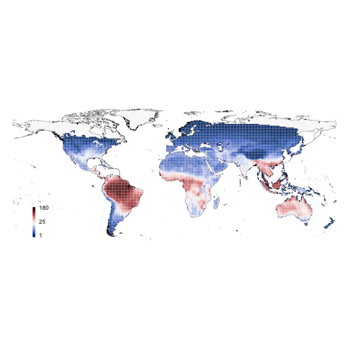
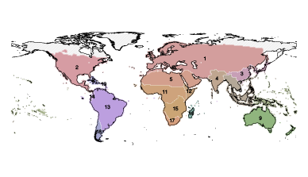
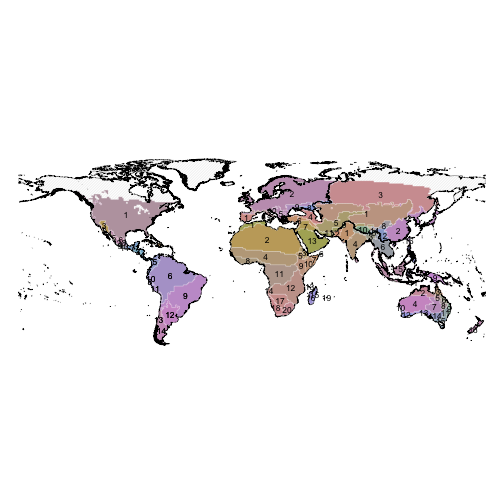
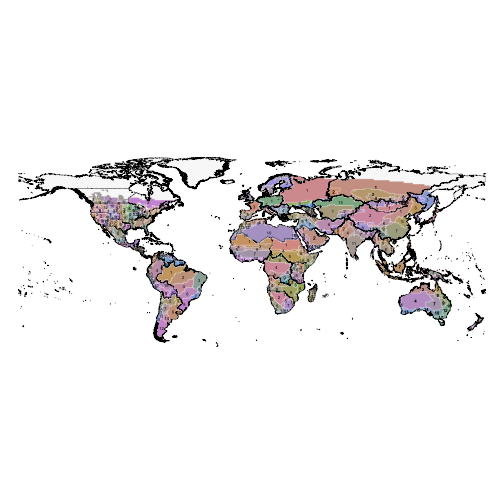

## Scale-dependence of `phyloregion` across spatial extents

In this vignette, we explore the sensitivity of `phyloregion` to big datasets in
analysis of phylogenetic regionalization across different spatial extents.
We varied the analysis across global, continental and subregional/local
spatial extents. To achieve this, we use data on the geographical
distributions and phylogenetic relationships of 10,040 species of squamate reptiles.

First, load the packages for the benchmarking:


```r
library(ape)
library(phyloregion)
library(raster)
```

```r
# Download data from our website https://barnabasdaru.com/. It is 511.3 MB big!
wd <- getwd()
dir = tempdir()
setwd(dir)
download.file(
    url="https://barnabasdaru.files.wordpress.com/2020/07/reptile_data.zip",
    destfile = "reptile_data.zip")
unzip(zipfile = "reptile_data.zip")
setwd(dir = "reptile_data")
list.files()
```

```
## [1] "merged_polygons" "phylo_trees"     "world_map"
```

```r
# 1. load world shapefiles at different spatial extents
wmap0 <- shapefile("world_map/level0/wrld_simpl.shp") # Global extent
wmap1 <- shapefile("world_map/level1/level1.shp") # Continental extent
wmap2 <- shapefile("world_map/level2/level2.shp") # Regional/local extent

# 2. Read in the phylogeny
tree <- read.tree("phylo_trees/ten_trees.trees")
tree
```

```
## 10 phylogenetic trees
```

```r
# 3. Read in species distributions as polygons
rept_map <- shapefile("merged_polygons/modeled_reptiles.shp")
head(rept_map)
```

```
##                Binomial        Area FID_2    TID  Group Value
## 0     Ablepharus budaki 121180.9012     2 R06993 lizard     1
## 1    Ablepharus darvazi  32444.7402     4 R06995 lizard     1
## 2   Ablepharus grayanus 130759.9117     6 R06997 lizard     1
## 3 Ablepharus kitaibelii 684246.0766     7 R06998 lizard     1
## 4 Ablepharus rueppellii  62791.4506    10 R07001 lizard     1
## 5      Abronia anzuetoi     38.3221    11 R00667 lizard     1
```

```r
setwd(wd)
```
## 2. Species distributional data conversion
Because the squamate reptile distribution data are available as polygons,
we use the function `polys2comm` to convert the polygons to a community
matrix at a spatial grain of 1 degree for downstream analyses.
Note that this resolution can be adjusted by varying the `res` argument in
the `polys2comm` function.


```r
pol <- polys2comm(rept_map, res = 1, species = "Binomial", trace=0)

M <- pol$comm_dat
colnames(M) <- gsub(" ", "_", colnames(M))

shp <- pol$poly_shp
proj4string(wmap0) <- proj4string(shp)
proj4string(wmap1) <- proj4string(shp)
proj4string(wmap2) <- proj4string(shp)

object.size(pol)
```

```
## 45704568 bytes
```

```r
object.size(M)
```

```
## 7401616 bytes
```

```r
mybeta_fun <- function(phy, dat){
  tmp <- match_phylo_comm(phy, dat)
  phylobeta(tmp$comm, tmp$phy)[[1]]
}

par(mar=rep(0,4))
plot(wmap0, col="grey", border = "grey", density = 37, lwd=0.25)
plot_swatch(shp, shp$richness, k = 30, border=NA,
            leg = 30, lwd = 5, add = TRUE, breaks = "jenks")
plot(wmap0, add=TRUE, lwd=0.25)
```



### 2.1. Scale dependence at the global extent
Here, we generate phyloregions at a global scale. We accounmted for
phylogenetic uncertainty in our analyses by drawing 10 trees at random
from a posterior distribution of 10,000 possible tree topologies.


```r
subx <- lapply(tree, function(x) mybeta_fun(x, M))
m <- mean_dist(subx, sort(labels(subx[[1]])), trace=0)

# Determine optimal clusters
(d <- optimal_phyloregion(m))
```

```
## $df
##     k        ev    totbss      tss
## 1   1 0.0000000    0.0000 1916.973
## 2   2 0.1208230  231.6144 1916.973
## 3   3 0.1297258  248.6809 1916.973
## 4   4 0.4065239  779.2954 1916.973
## 5   5 0.4084138  782.9182 1916.973
## 6   6 0.4168680  799.1248 1916.973
## 7   7 0.4169794  799.3382 1916.973
## 8   8 0.4881418  935.7546 1916.973
## 9   9 0.5581356 1069.9309 1916.973
## 10 10 0.6088059 1167.0644 1916.973
## 11 11 0.6801973 1303.9198 1916.973
## 12 12 0.6882992 1319.4510 1916.973
## 13 13 0.7038375 1349.2375 1916.973
## 14 14 0.7042261 1349.9824 1916.973
## 15 15 0.7084495 1358.0785 1916.973
## 16 16 0.7235731 1387.0702 1916.973
## 17 17 0.7466985 1431.4009 1916.973
## 18 18 0.7481518 1434.1868 1916.973
## 19 19 0.7482241 1434.3254 1916.973
## 20 20 0.7483526 1434.5717 1916.973
## 
## $optimal
## $k
## [1] 11
## 
## $ev
## [1] 0.6801973
## 
## $inc.thres
## [1] 0.01
## 
## $ev.thres
## [1] 0.67
## 
## attr(,"description")
## [1] "A \"good\" k=11 (EV=0.68) is detected when the EV is no less than 0.67\nand the increment of EV is no more than 0.01 for a bigger k.\n"
## attr(,"class")
## [1] "elbow" "list"
```

```r
z <- phyloregion(m, k = d$optimal$k, shp = shp)

par(mar=rep(0,4))
plot(wmap0, col="grey", border = "grey", density = 37, lwd=0.25)
plot(z, lwd=0.25, add=TRUE)
plot(wmap0, add=TRUE, lwd=0.25)
```



### 2.2. Scale dependence at continental extent
Here, we generate phyloregions at the extent of continents. To account for
phylogenetic uncertainty in our analyses, we drew 10 trees at random
from a posterior distribution of 10,000 possible tree topologies.


```r
level1 <- cbind(as.data.frame(shp), sp::over(shp, wmap1))
level1 <- level1[complete.cases(level1),]
comm <- sparse2long(M)

S <- unique(level1$LEVEL1_NAM)

out <- list()
for (i in seq_along(S)) {
    tryCatch({
        y1 <- subset(level1, level1$LEVEL1_NAM %in% S[i])
        mx <- subset(comm, comm$grids %in% intersect(y1$grids, comm$grids))

        subx <- lapply(tree, function(x) mybeta_fun(x, long2sparse(mx)))
        m <- mean_dist(subx, sort(labels(subx[[1]])), trace=0)

        # Determine optimal clusters
        (d <- optimal_phyloregion(m))
        z <- phyloregion(m, k = d$optimal$k, shp = shp)$shp
        z$region <- S[i]

    }, error = function(e){})
    out[[i]] <- z
}


result1 <- do.call("rbind", out)

par(mar=rep(0,4))
plot(wmap1, col="grey", border = "grey", density = 37, lwd=0.25)
plot(result1, col=as.character(result1$COLOURS),
     border="white", lwd=0.25, add=TRUE)
text(result1, labels=result1$cluster, cex =0.7)
plot(wmap1, add=TRUE, lwd=0.25)
```



### 2.3. Scale dependence at local/regional scale
Here, we generate phyloregions at the extent of regions or country borders.


```r
level2 <- cbind(as.data.frame(shp), sp::over(shp, wmap2))
level2 <- level2[complete.cases(level2),]

S <- unique(level2$LEVEL2_NAM)

spo <- list()
for (i in seq_along(S)) {
    tryCatch({
        y1 <- subset(level2, level2$LEVEL2_NAM %in% S[i])
        mx <- subset(comm, comm$grids %in% intersect(y1$grids, comm$grids))

        subx <- lapply(tree, function(x) mybeta_fun(x, long2sparse(mx)))

        m <- mean_dist(subx, sort(labels(subx[[1]])), trace=0)

        # Determine optimal clusters
        (d <- optimal_phyloregion(m))
        z <- phyloregion(m, k = d$optimal$k, shp = shp)$shp
        z$region <- S[i]

    }, error = function(e){})

    spo[[i]] <- z
}


result2 <- do.call("rbind", spo)

par(mar=rep(0,4))
plot(wmap2, col="grey", border = "grey", density = 37, lwd=0.25)
plot(result2, col=as.character(result2$COLOURS),
     border="white", lwd=0.25, add=TRUE)
text(result2, labels=result2$cluster, cex =0.35)
plot(wmap2, add=TRUE, lwd=0.25)
```



Just as there is increasing evidence that patterns of biodiversity are
scale-dependent[@daru2020endemism],[@jarzyna2018taxonomic], it is likely
that the mechanisms underlying patterns of biogeographic regionalization
are sensitive to differences in spatial grain and extent.

## Session Infomation

```r
sessionInfo()
```

```
## R version 4.0.2 (2020-06-22)
## Platform: x86_64-apple-darwin17.0 (64-bit)
## Running under: macOS Catalina 10.15.6
## 
## Matrix products: default
## BLAS:   /System/Library/Frameworks/Accelerate.framework/Versions/A/Frameworks/vecLib.framework/Versions/A/libBLAS.dylib
## LAPACK: /Library/Frameworks/R.framework/Versions/4.0/Resources/lib/libRlapack.dylib
## 
## locale:
## [1] en_US.UTF-8/en_US.UTF-8/en_US.UTF-8/C/en_US.UTF-8/en_US.UTF-8
## 
## attached base packages:
## [1] stats     graphics  grDevices utils     datasets  methods   base     
## 
## other attached packages:
## [1] raster_3.3-7      sp_1.4-2          phyloregion_1.0.3 ape_5.4           knitr_1.29       
## 
## loaded via a namespace (and not attached):
##  [1] igraph_1.2.5     Rcpp_1.0.5       cluster_2.1.0    magrittr_1.5     splines_4.0.2   
##  [6] magic_1.5-9      MASS_7.3-51.6    colorspace_1.4-1 lattice_0.20-41  quadprog_1.5-8  
## [11] fastmatch_1.1-0  geometry_0.4.5   highr_0.8        stringr_1.4.0    tools_4.0.2     
## [16] rgdal_1.5-12     parallel_4.0.2   grid_4.0.2       nlme_3.1-148     phangorn_2.5.5  
## [21] mgcv_1.8-31      xfun_0.15        vegan_2.5-6      rgeos_0.5-3      abind_1.4-5     
## [26] betapart_1.5.1   picante_1.8.2    permute_0.9-5    Matrix_1.2-18    codetools_0.2-16
## [31] rcdd_1.2-2       evaluate_0.14    stringi_1.4.6    compiler_4.0.2   pkgconfig_2.0.3
```

## REFERENCES
