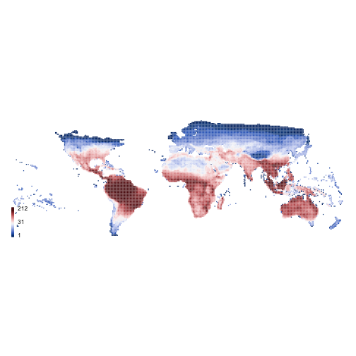
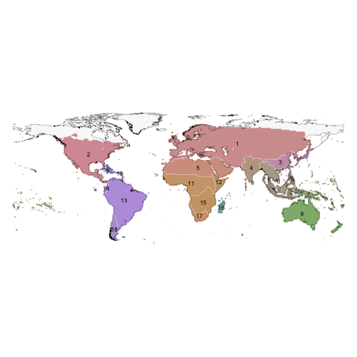
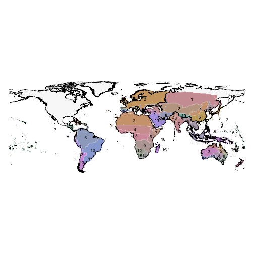

## Scale-dependence of `phyloregion` across spatial extents

In this vignette, we explore the sensitivity of `phyloregion` to big datasets in
analysis of phylogenetic regionalization across different spatial extents.
We varied the analysis across global, continental and subregional/local
spatial extents. To achieve this, we use data on the geographical
distributions and phylogenetic relationships of 10,040 species of squamate reptiles.

First, load the packages for the benchmarking:


```r
library(ape)
library(phyloregion)
library(raster)
```

```r
# Download the data from Dropbox.
dir = tempdir()
setwd(dir)
download.file(url = "https://www.dropbox.com/s/6z4koibfqmvkn64/reptile_data.zip?dl=1",
              destfile = "reptile_data.zip")
unzip(zipfile = "reptile_data.zip")
setwd(dir = "reptile_data")
list.files()
```

```
## [1] "merged_polygons" "phylo_trees"     "world_map"
```

```r
# 1. load world shapefiles at different spatial extents
wmap0 <- shapefile("world_map/level0/wrld_simpl.shp") # Global extent
wmap1 <- shapefile("world_map/level1/level1.shp") # Continental extent
wmap2 <- shapefile("world_map/level2/level2.shp") # Regional/local extent

# 2. Read in phylogeny
tree <- read.tree("phylo_trees/ten_trees.trees")
tree
```

```
## 10 phylogenetic trees
```

```r
# 3. Species distributions as range polygons
rept_map <- shapefile("merged_polygons/modeled_reptiles.shp")
head(rept_map)
```

```
##                Binomial        Area FID_2    TID  Group Value
## 0     Ablepharus budaki 121180.9012     2 R06993 lizard     1
## 1    Ablepharus darvazi  32444.7402     4 R06995 lizard     1
## 2   Ablepharus grayanus 130759.9117     6 R06997 lizard     1
## 3 Ablepharus kitaibelii 684246.0766     7 R06998 lizard     1
## 4 Ablepharus rueppellii  62791.4506    10 R07001 lizard     1
## 5      Abronia anzuetoi     38.3221    11 R00667 lizard     1
```
## 2. Species distributional data conversion
Because the squamate reptile distribution data is available as extent-of-occurrence
range maps, we use the function `polys2comm` to convert the range
polygons to a community composition data frame at a spatial grain of 1 degree
for downstream analyses.


```r
pol <- polys2comm(rept_map, res = 1, species = "Binomial")

comm <- pol$comm_dat
head(comm)
```

```
##    grids           species
## 1 v12163 Ablepharus budaki
## 2 v12164 Ablepharus budaki
## 3 v12518 Ablepharus budaki
## 4 v12519 Ablepharus budaki
## 5 v12520 Ablepharus budaki
## 6 v12521 Ablepharus budaki
```

```r
comm$species <- gsub(" ", "_", comm$species)

shp <- pol$poly_shp
proj4string(wmap0) <- proj4string(shp)
proj4string(wmap1) <- proj4string(shp)
proj4string(wmap2) <- proj4string(shp)

object.size(pol)
```

```
## 53114088 bytes
```

```r
object.size(comm)
```

```
## 10297352 bytes
```

```r
mybeta_fun <- function(phy, dat){
  subphy <- match_phylo_comm(phy, long2sparse(dat))$phy
  subdat <- match_phylo_comm(phy, long2sparse(dat))$comm
  pb <- phylobeta(subdat, subphy)[[1]]
  pb
}

par(mar=rep(0,4))
plot_swatch(shp, shp$richness, k = 30, leg = 30, lwd = 5)
```



### 2.1. Scale dependence at global extent
Here, we generate phyloregions at a global scales. We accounmted for
phylogenetic uncertainty in our analyses by drawing 10 trees at random
from a posterior distribution of 10,000 possible tree topologies.


```r
#subx <- lapply(tree, function(x) mybeta_fun(x, M))
#m <- mean_dist(subx, sort(labels(subx[[1]])))
m <- read.csv("/Users/barnabasdaru/Dropbox/Projects/phyloregion_MS/data/reptiles/pbsim_matrix.xz", row.names = 1)

# Determine optimal clusters
(d <- optimal_phyloregion(m))
```

```
## $df
##     k        ev    totbss      tss
## 1   1 0.0000000    0.0000 2219.258
## 2   2 0.1043141  231.4998 2219.258
## 3   3 0.1166835  258.9507 2219.258
## 4   4 0.3552748  788.4463 2219.258
## 5   5 0.4787510 1062.4718 2219.258
## 6   6 0.4860290 1078.6236 2219.258
## 7   7 0.5541438 1229.7879 2219.258
## 8   8 0.6149130 1364.6505 2219.258
## 9   9 0.6737209 1495.1603 2219.258
## 10 10 0.6904988 1532.3947 2219.258
## 11 11 0.6921561 1536.0727 2219.258
## 12 12 0.7079223 1571.0619 2219.258
## 13 13 0.7138754 1584.2734 2219.258
## 14 14 0.7335367 1627.9069 2219.258
## 15 15 0.7342280 1629.4411 2219.258
## 16 16 0.7418017 1646.2491 2219.258
## 17 17 0.7460244 1655.6202 2219.258
## 18 18 0.7609044 1688.6429 2219.258
## 19 19 0.7616763 1690.3558 2219.258
## 20 20 0.7618037 1690.6388 2219.258
## 
## $optimal
## $k
## [1] 18
## 
## $ev
## [1] 0.7609044
## 
## $inc.thres
## [1] 0.01
## 
## $ev.thres
## [1] 0.75
## 
## attr(,"description")
## [1] "A \"good\" k=18 (EV=0.76) is detected when the EV is no less than 0.75\nand the increment of EV is no more than 0.01 for a bigger k.\n"
## attr(,"class")
## [1] "elbow" "list"
```

```r
z <- ed_phyloregion(m, k = d$optimal$k, shp = shp)$evol_distinct

par(mar=rep(0,4))
plot(wmap0, col="grey", border = "grey", density = 37, lwd=0.25)
plot(z, col=as.character(z$COLOURS),
     border="white", lwd=0.25, add=TRUE)
text(z, labels=z$cluster, cex =0.7)
plot(wmap0, add=TRUE, lwd=0.25)
```



### 2.2. Scale dependence at continental extent
Here, we generate phyloregions at the extent of continents. To account for
phylogenetic uncertainty in our analyses, we drew 10 trees at random
from a posterior distribution of 10,000 possible tree topologies.


```r
level1 <- cbind(as.data.frame(shp), sp::over(shp, wmap1))
level1 <- level1[complete.cases(level1),]

S <- unique(level1$LEVEL1_NAM)

out <- list()
for (i in seq_along(S)) {
  tryCatch({
  y1 <- subset(level1, level1$LEVEL1_NAM %in% S[i])
  index <- intersect(y1$grids, comm$grids)
  M <- subset(comm, comm$grids %in% index)

  subx <- lapply(tree, function(x) mybeta_fun(x, M))
  m <- mean_dist(subx, sort(labels(subx[[1]])))

  # Determine optimal clusters
  (d <- optimal_phyloregion(m))
  z <- ed_phyloregion(m, k = d$optimal$k, shp = shp)$evol_distinct
  z$region <- S[i]

  }, error = function(e){})
  out[[i]] <- z
}


result1 <- do.call("rbind", out)

par(mar=rep(0,4))
plot(wmap1, col="grey", border = "grey", density = 37, lwd=0.25)
plot(result1, col=as.character(result1$COLOURS),
     border="white", lwd=0.25, add=TRUE)
text(result1, labels=result1$cluster, cex =0.7)
plot(wmap1, add=TRUE, lwd=0.25)
```



### 2.3. Scale dependence at local/regional scale
Here, we generate phyloregions at the extent of regions or country borders.


